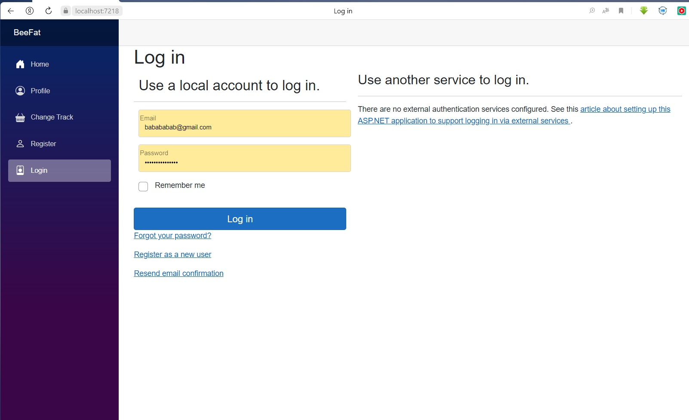
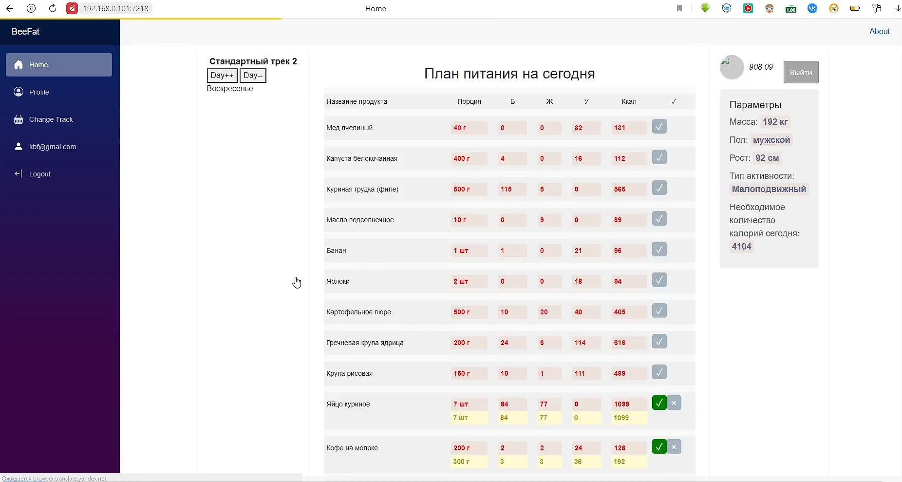
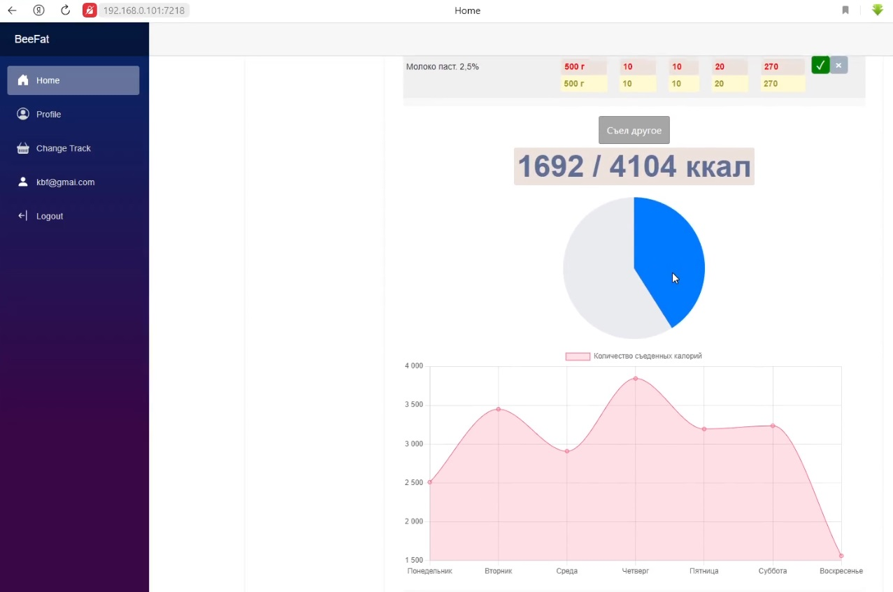

# BeFatBee

Наше веб-приложение представляет собой инструмент, помогающий людям настроить свой режим питания и после отслеживать его. Мы стремимся учесть финансовые возможности и персональные особенности каждого пользователя, чтобы предложить ему оптимальные рекомендации.

Одной из ключевых особенностей нашего приложения является способность адаптироваться под параметры пользователя: рост, вес, возраст, желаемое количество калорий, а также финансовые возможности и личные особенности. Например, если у пользователя есть аллергия на молочные продукты, приложение будет исключать такие продукты из его рациона и предлагать альтернативы.

Приложение также будет иметь возможность отображать различную статистику (динамика изменения веса и т. д.), связанную с питанием. Это может включать в себя данные о потреблении калорий, углеводов, белков, жиров. Эта статистика поможет пользователям контролировать свои показатели и отслеживать прогресс.

Также пользователи смогут выбрать из различных треков питания, соответствующих различным целям. Например, для людей, стремящихся похудеть, мы можем предложить трек с низким содержанием углеводов, а для тех, кто стремится набрать мышечную массу, - трек с высоким содержанием белка. Кроме того, приложение будет позволять пользователям создавать свои собственные треки питания, учитывая их предпочтения и цели.

В целом, наше веб-приложение открывает новые возможности для пользователей в области питания. Оно поможет им разработать и поддерживать питательную и сбалансированную диету, учитывая их финансовые ограничения и личные особенности. Наше приложение станет незаменимым инструментом для тех, кто стремится улучшить свое питание и поддерживать здоровый образ жизни.

## Примерный интерфейс

